# Bargheto App

**Bargheto** is a smart, digital platform for industrial electricity procurement in Iran.  
This repository showcases my work as a **Flutter developer** on the Bargheto project.

---

## 📱 About the App

Bargheto enables online purchase of industrial electricity, flexible payment terms, and bilateral contracts. It simplifies electricity procurement for industries, organizations, and energy investors through a fully digital process.

### 📌 Key Highlights

- Industrial electricity procurement with flexible contracts
- Clean and maintainable Flutter codebase
- Strong localization and RTL support for Persian
- Secure user authentication
- Smooth user experience with polished animations and charts

---

## 👨‍💻 My Role

As a **Flutter developer**, my responsibilities included:
- Designing and building a responsive, modern UI
- Implementing **state management** using **GetX**
- Integrating **REST APIs** with **Dio**
- Applying **Clean Architecture** principles
- Implementing localization and RTL support for Persian language
- Managing user authentication with **local_auth** and **smart_auth**
- Optimizing performance and app startup (splash screen)
- Handling file operations, QR scanning, charts, and animations

---

## 🛠️ Tech Stack & Dependencies

Here’s a summary of the main technologies and packages used in Bargheto:

| Category | Package |
| ---------------- | ------------------------------- |
| **State Management** | [GetX](https://pub.dev/packages/get) |
| **HTTP Client** | [Dio](https://pub.dev/packages/dio), [Pretty Dio Logger](https://pub.dev/packages/pretty_dio_logger) |
| **Localization** | [flutter_localization](https://pub.dev/packages/flutter_localization), [intl](https://pub.dev/packages/intl), [flutter_localizations](https://api.flutter.dev/flutter/flutter_localizations/flutter_localizations-library.html) |
| **Logging** | [Logger](https://pub.dev/packages/logger) |
| **Storage** | [shared_preferences](https://pub.dev/packages/shared_preferences) |
| **Utilities** | [equatable](https://pub.dev/packages/equatable), [shamsi_date](https://pub.dev/packages/shamsi_date), [persian_number_utility](https://pub.dev/packages/persian_number_utility) |
| **Authentication** | [local_auth](https://pub.dev/packages/local_auth), [smart_auth](https://pub.dev/packages/smart_auth) |
| **Files & Media** | [file_picker](https://pub.dev/packages/file_picker), [open_file](https://pub.dev/packages/open_file), [path_provider](https://pub.dev/packages/path_provider), [image_picker](https://pub.dev/packages/image_picker) |
| **Web & HTML** | [flutter_inappwebview](https://pub.dev/packages/flutter_inappwebview), [universal_html](https://pub.dev/packages/universal_html) |
| **Animations & Graphics** | [Lottie](https://pub.dev/packages/lottie), [flutter_svg](https://pub.dev/packages/flutter_svg) |
| **Charts** | [fl_chart](https://pub.dev/packages/fl_chart) |
| **UI Enhancements** | [skeletonizer](https://pub.dev/packages/skeletonizer), [pinput](https://pub.dev/packages/pinput), [expandable](https://pub.dev/packages/expandable), [flutter_spinkit](https://pub.dev/packages/flutter_spinkit), [fading_edge_scrollview](https://pub.dev/packages/fading_edge_scrollview), [smooth_page_indicator](https://pub.dev/packages/smooth_page_indicator) |
| **Device & Info** | [package_info_plus](https://pub.dev/packages/package_info_plus), [pointer_interceptor](https://pub.dev/packages/pointer_interceptor) |
| **QR & Scanning** | [mobile_scanner](https://pub.dev/packages/mobile_scanner) |
| **Sharing & Links** | [share_plus](https://pub.dev/packages/share_plus), [url_launcher](https://pub.dev/packages/url_launcher) |
| **Splash Screen** | [flutter_native_splash](https://pub.dev/packages/flutter_native_splash) |
| **Icons** | [cupertino_icons](https://pub.dev/packages/cupertino_icons) |

---

## 🗂️ Project Structure

```
lib/
 ├── core/
    ├── components
    ├── routes
    ├── services
    ├── theme
    ├── types
    ├── utils

 ├── features/
    ├── Splash
    ├── Onboarding
    ├── Accounting
    ├── Authentication
    ├── Bill
    ├── Company
    ├── Contract
    ├── Invoice
    ├── Persons
    ├── PowerSupply
    ├── Setting
    ├── Statistics
    ├── Tickets
```

---

## 📸 Screenshots

_Screenshots of the Bargheto app will be added here soon._

| Screen | Screenshot |
| ------ | ----------- |
| Login | 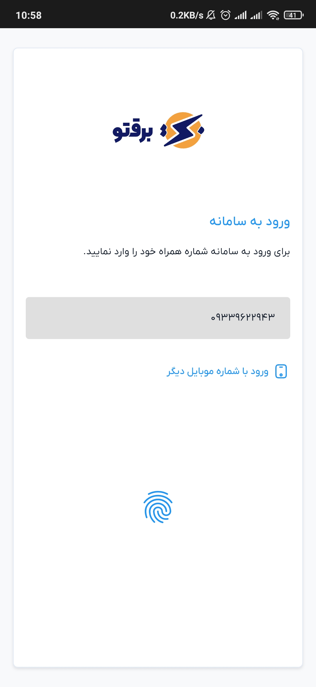 |
| Dashboard | 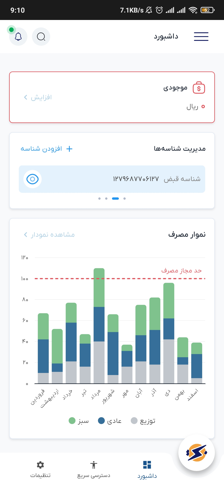 |
| OTP | 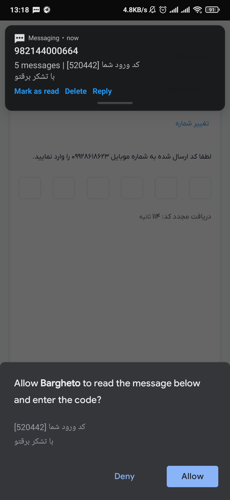 |
| Drawer | 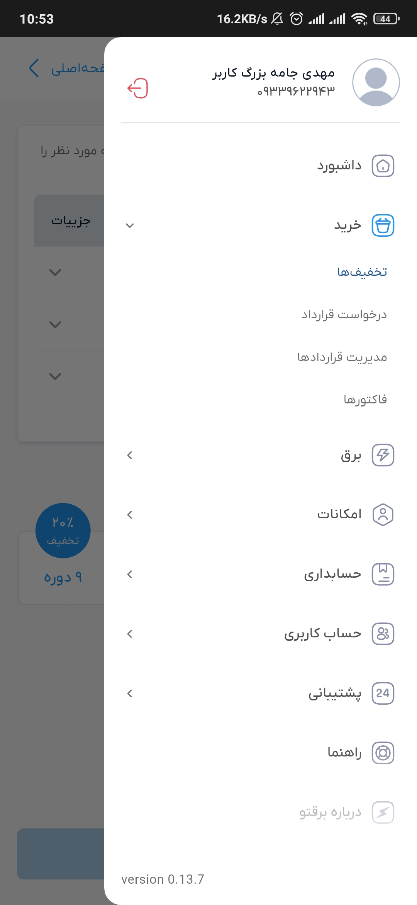 |
| Credit | 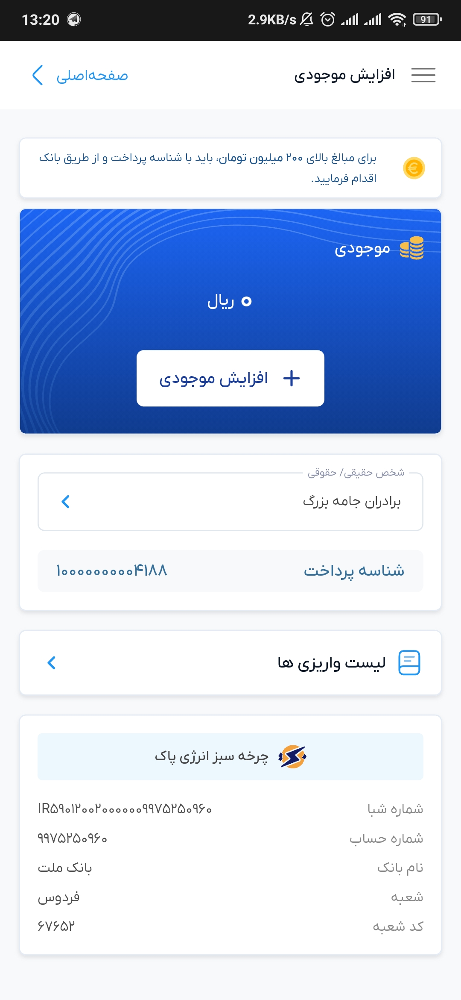 |
| User | 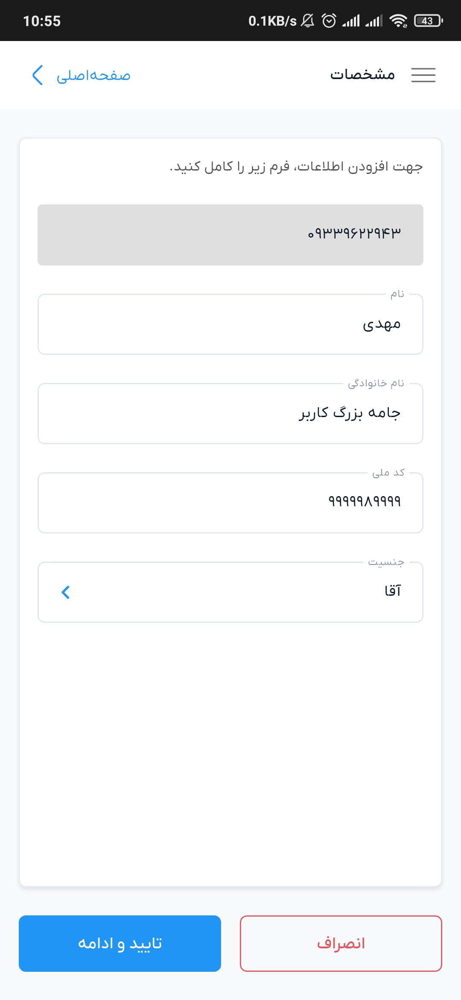 |
| Accounting | 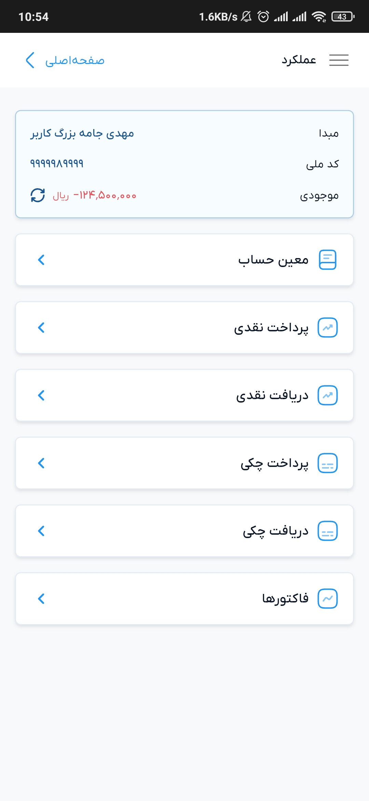 |
| Bills | 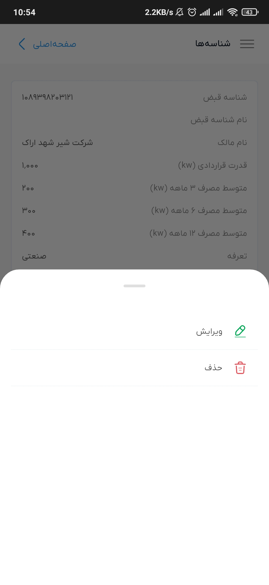 |
| Add Contract | 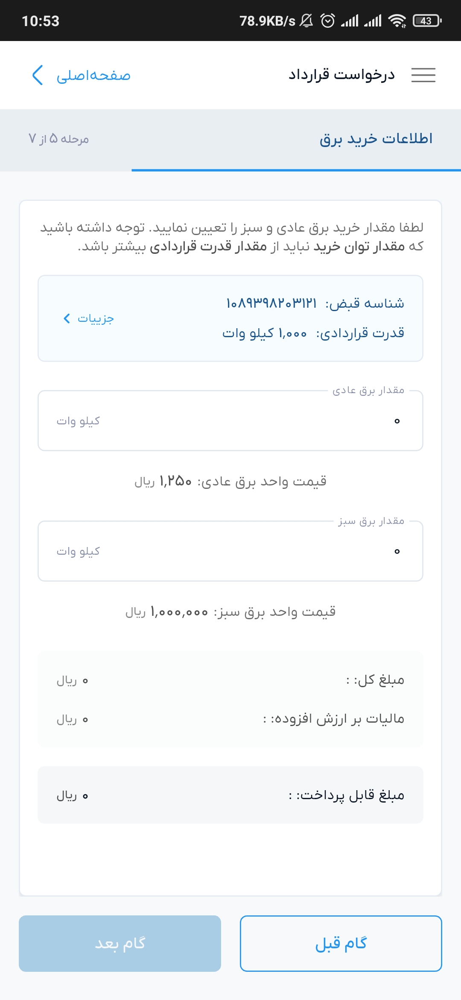 |
| Contracts | 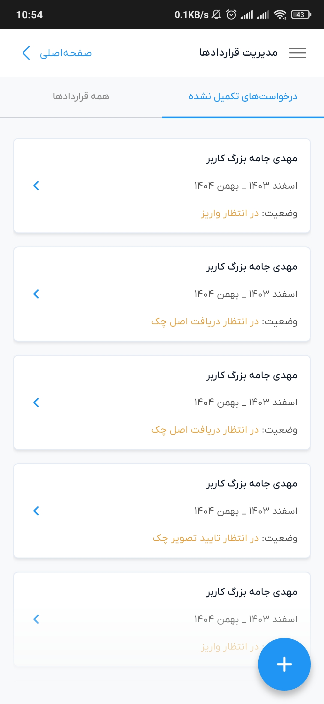 |
| Contract Details | 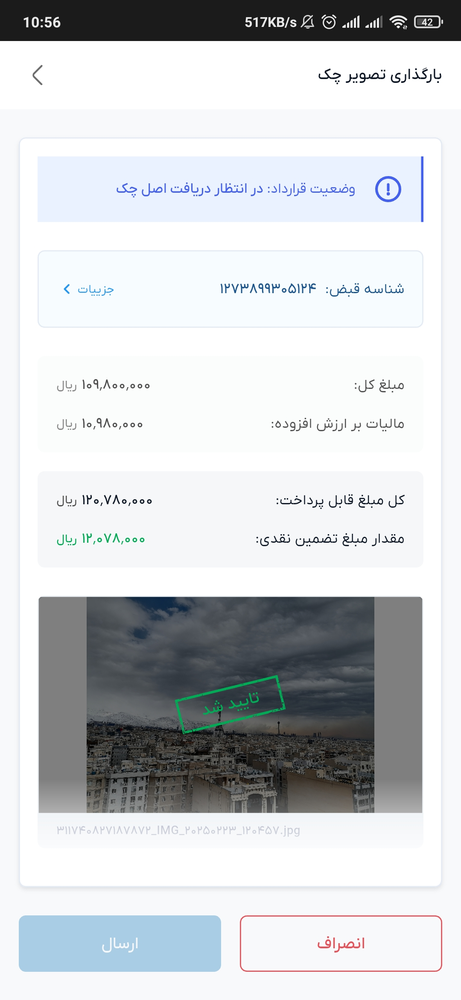 |
| Ticketing | 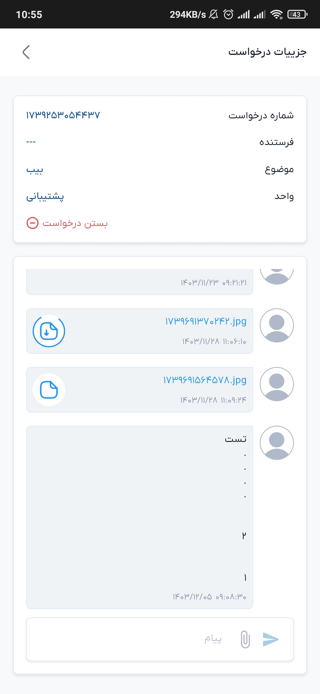 |

## 📄 License

_This repository is for portfolio and presentation purposes only. The app’s source code is not publicly available._

---
