# Bargheto (برقتو)

[](https://flutter.dev)
[](#-architecture--project-structure)
[](#)

**Bargheto** is the first and largest private digital platform for industrial electricity procurement and energy management in Iran. This repository showcases my engineering layout, architectural patterns, and production-grade implementations as the **Lead Mobile Software Engineer & Architect** on the project.

---

## 🔗 Production Links

- [Official Website & Downloads](https://bargheto.com/download-app)
- [Live PWA Application](https://app.bargheto.com)
- [Cafe Bazaar (Android)](https://cafebazaar.ir/app/com.bargheto.client)
- [Myket (Android)](https://myket.ir/app/com.bargheto.client)

---

## 📱 About the Platform

Bargheto digitizes highly complex electricity procurement workflows for large industries, state organizations, and green energy investors. The application facilitates flexible corporate utility billing, bilateral electrical contracts, real-time consumption monitoring, and legal energy transactions within a highly secured financial framework.

---

## 👨‍💻 Key Software Engineering Challenges & Solutions

Navigating this large-scale industrial utility system required overcoming critical software design constraints:

*   **Volatile Business Rules & Domain Requirements:** The deregulated energy industry presented continuous changes in regulatory laws and payment terms. 
    *   *Solution:* Enforced strict **Clean Architecture (Data, Domain, Presentation layers)** combined with independent feature modules to isolate business logic from UI changes, achieving zero-regression deployments.
*   **Platform-Specific & Native Constraints:** Certain high-security enterprise integrations and web-context handling required moving past standard cross-platform APIs.
    *   *Solution:* Engineered tailored platform channels and custom **Native Bridges (Kotlin for Android / Swift for iOS)** to build a unified, deterministic hardware API layer.
*   **Environment Orchestration & Multi-Tenant Deployment:** Managing separate builds for engineering sprints, integration testing, and final live release cycles.
    *   *Solution:* Designed automated **multi-flavor CI/CD configurations (Dev, Test, Production)**, ensuring rigid isolation of endpoints, cryptographic keys, and automated testing variables.
*   **End-to-End Technical Lifecycle Ownership:** Taking the application from raw requirement gathering and system design up to continuous market distribution.
    *   *Solution:* Translated abstract enterprise business criteria into scalable data schemas, managed complex package lifetimes, and streamlined production deployments.
*   **Production Telemetry & User Observability:** Tracking real-time runtime exceptions, structural layout behaviors, and UI performance blockages without compromising user privacy.
    *   *Solution:* Integrated **Microsoft Clarity** along with analytical logging streams to actively monitor session replays, isolate client-side friction, and drive data-backed performance patches.

---

## 🛠️ Deep-Dive Tech Stack & Dependency Layout

| Category | Technical Packages & Frameworks | Architectural Purpose |
| :--- | :--- | :--- |
| **State Management** | `GetX`, `equatable` | Micro-state isolation, reactive data streams, dynamic memory management |
| **Networking & HTTP** | `Dio`, `pretty_dio_logger` | Advanced interceptors, global exception routing, automated retry layers |
| **Storage & Caching** | `shared_preferences` | Decentralized lightweight offline caching of key transaction parameters |
| **Security & Auth** | `local_auth`, `smart_auth`, `pinput` | Secure biometric authentication, automated SMS-OTP handshake layers |
| **Native Web Context**| `flutter_inappwebview`, `universal_html`, `pointer_interceptor` | Resilient sandbox execution of web modules across PWA and mobile viewports |
| **Telemetry & Scan** | `mobile_scanner`, `logger` | Hardware-optimized QR processing, systematic environmental debugging |
| **Analytics & UI** | `fl_chart`, `skeletonizer`, `lottie` | High-fidelity financial charts, asset visualization, non-blocking skeleton loaders |
| **Localization & L10n**| `flutter_localization`, `intl`, `shamsi_date`, `persian_number_utility` | Strict RTL structural rendering, Jalali/Shamsi calendar integrations |

---

## 🗂️ Architecture & Project Structure

The codebase is organized using a **Feature-First + Layered Clean Architecture** approach. This strict separation of concerns isolates external frameworks, keeps the domain layer highly testable, and prevents feature tightly-coupling.

```text
lib/
 ├── core/                    # Application-wide global infrastructures
 │    ├── components/         # Atomic, reusable agnostic UI widgets
 │    ├── routes/             # Strongly-typed named route definitions
 │    ├── services/           # Persistent background services (Auth, Storage, API)
 │    ├── theme/              # Centralized tokenized UI theme matrices
 │    └── utils/              # Pure functional extensions & helpers
 │
 ├── features/                # Domain-driven decoupled modules
 │    ├── Splash / Onboarding # Application boot-up lifecycle routines
 │    ├── Authentication      # Secured access control pipelines
 │    ├── Accounting / Bill   # High-concurrency utility billing & ledgers
 │    ├── Contract / Invoice  # Bilateral industrial contract configurations
 │    ├── PowerSupply         # Real-time hardware node monitoring
 │    ├── Statistics          # Highly optimized fl_chart implementations
 │    └── Tickets             # B2B enterprise real-time support pipelines

```
---

## 📸 Screenshots

| Screen | Screenshot |
| ------ | ----------- |
| Login | 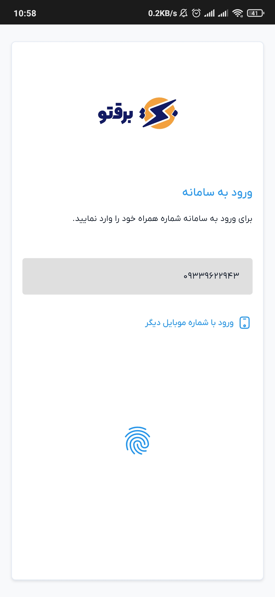 |
| Dashboard | 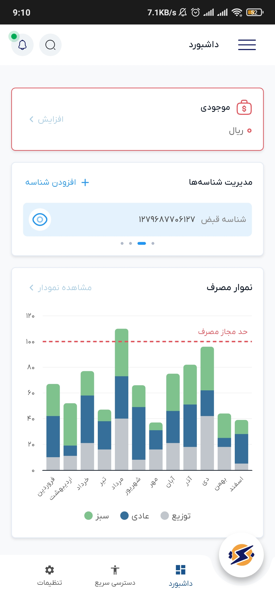 |
| OTP | 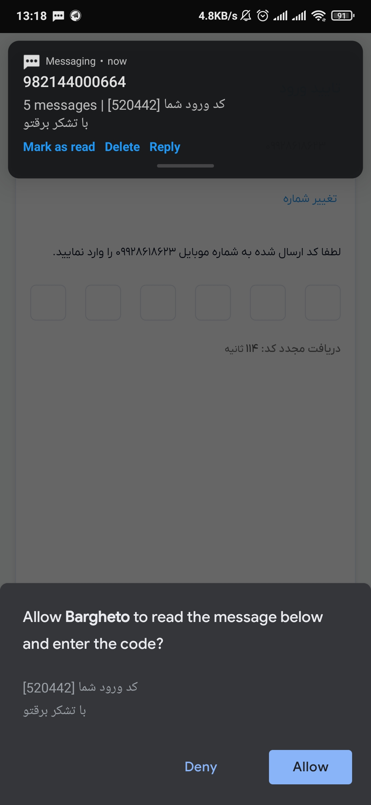 |
| Drawer | 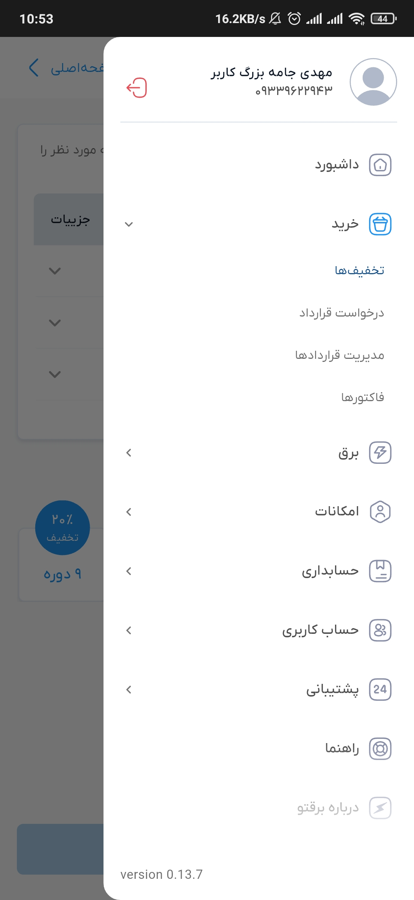 |
| Credit | 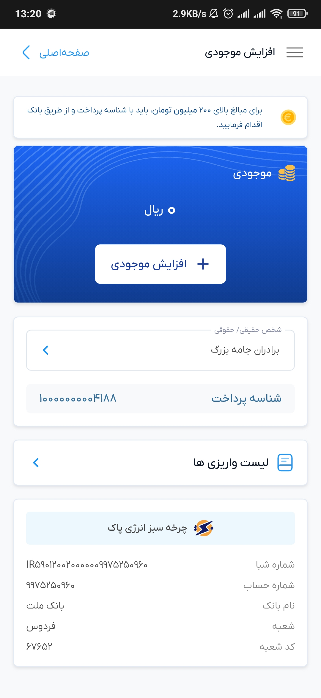 |
| User | 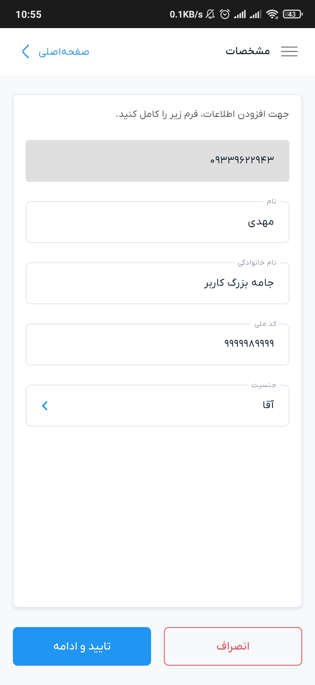 |
| Accounting | 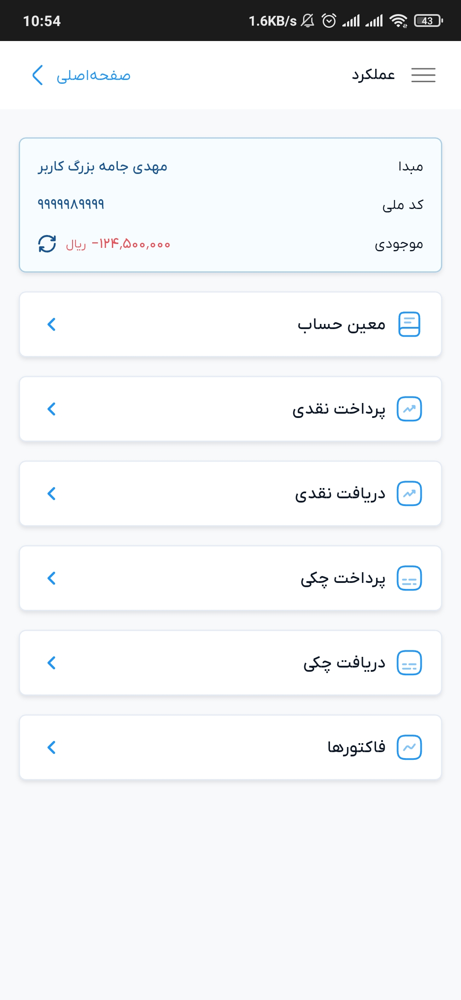 |
| Bills | 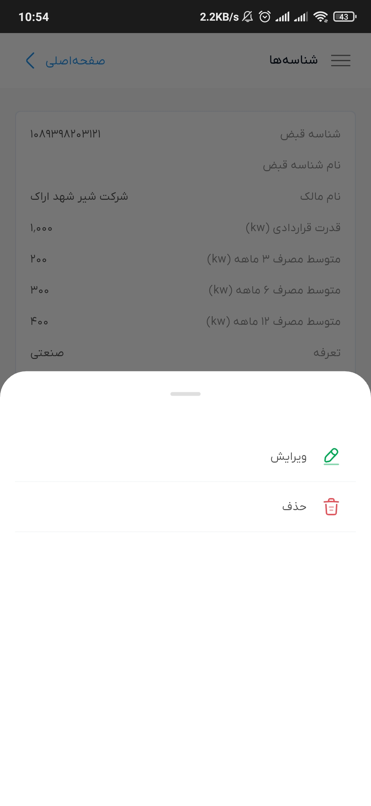 |
| Add Contract | 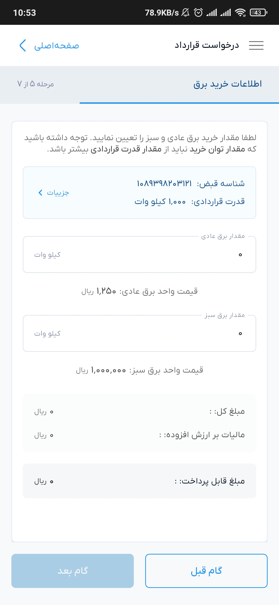 |
| Contracts | 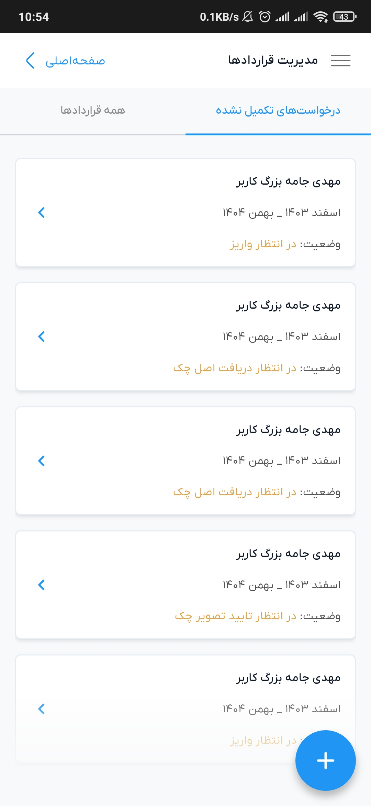 |
| Contract Details | 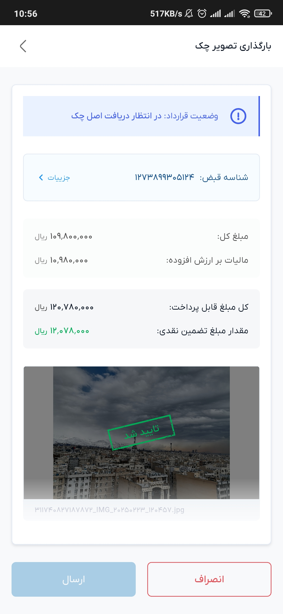 |
| Ticketing | 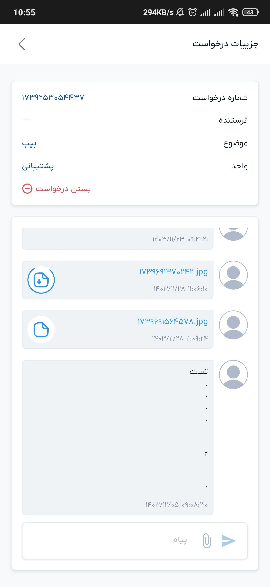 |

--- 

## 📄 License

This repository is for portfolio and presentation purposes only. The app’s source code is not publicly available._

--- 

