# Bargheto (برقتو)

[](https://flutter.dev)
[](#%EF%B8%8F-architecture--project-structure)
[](#-production-links)
[](#-about-the-platform)

**Bargheto** is a leading digital platform for industrial electricity procurement and energy management in Iran, used by **50,000+ users** across Android, iOS and the web.

This repository presents the architecture and engineering approach behind the Flutter client, which I designed and led as **Head Mobile Engineer** (Nov 2024 – Aug 2026). The source code is private; this is a portfolio overview.

---

## 🔗 Production Links

- [Official Website & Downloads](https://bargheto.com/download-app)
- [Live PWA Application](https://app.bargheto.com)
- [Cafe Bazaar (Android)](https://cafebazaar.ir/app/com.bargheto.client)
- [Myket (Android)](https://myket.ir/app/com.bargheto.client)

---

## 📱 About the Platform

Bargheto digitizes electricity procurement for large industrial consumers, organizations and green energy investors: utility billing, bilateral electricity contracts, consumption monitoring and energy transactions, all within a regulated financial framework.

One Flutter codebase ships to **Android, iOS and PWA**.

---

## 👨‍💻 Engineering Challenges & Solutions

**Constantly changing business rules.**
Energy market regulations and payment terms change often.
*Solution:* Clean Architecture (data, domain, presentation) with independent feature modules, so business logic changes stay isolated from the UI and regressions stay contained.

**Going beyond cross-platform APIs.**
Some integrations and web-context handling weren't possible with standard Flutter plugins.
*Solution:* Custom platform channels and native code in **Kotlin (Android)** and **Swift (iOS)** behind a single Dart API.

**Separate environments for development, testing and release.**
*Solution:* Build flavors per environment with isolated endpoints and keys, plus an automated CI/CD pipeline for build, test and release.

**End-to-end ownership.**
Took the app from requirements and system design to release on app stores and the web, and ongoing iteration based on user feedback.

**Production observability.**
*Solution:* **Microsoft Clarity** session replays and structured logging to find UX friction and client-side errors, and prioritize fixes with real usage data.

---

## 🛠️ Tech Stack

| Category | Packages | Purpose |
| :--- | :--- | :--- |
| **State Management** | `GetX`, `equatable` | Reactive state and dependency management |
| **Networking** | `Dio`, `pretty_dio_logger` | Interceptors, centralized error handling, request logging |
| **Storage** | `shared_preferences` | Lightweight local persistence |
| **Security & Auth** | `local_auth`, `smart_auth`, `pinput` | Biometric login and SMS OTP auto-fill |
| **Web Content** | `flutter_inappwebview`, `universal_html`, `pointer_interceptor` | Embedded web modules across mobile and PWA |
| **Scanning & Logging** | `mobile_scanner`, `logger` | QR scanning and structured debug logging |
| **Charts & UI** | `fl_chart`, `skeletonizer`, `lottie` | Financial and consumption charts, skeleton loaders, animations |
| **Localization** | `flutter_localization`, `intl`, `shamsi_date`, `persian_number_utility` | Full RTL support and Jalali (Shamsi) calendar |

---

## 🗂️ Architecture & Project Structure

The codebase follows a **feature-first, layered Clean Architecture**: framework details stay at the edges, the domain layer stays testable, and features stay decoupled from each other.

```text
lib/
 ├── core/                    # App-wide infrastructure
 │    ├── components/         # Reusable UI widgets
 │    ├── routes/             # Named route definitions
 │    ├── services/           # Auth, storage and API services
 │    ├── theme/              # Centralized design tokens and themes
 │    └── utils/              # Extensions and helpers
 │
 ├── features/                # Independent feature modules
 │    ├── Splash / Onboarding # App startup
 │    ├── Authentication      # Login, OTP and biometrics
 │    ├── Accounting / Bill   # Billing and account ledgers
 │    ├── Contract / Invoice  # Bilateral electricity contracts
 │    ├── PowerSupply         # Power supply and consumption monitoring
 │    ├── Statistics          # Consumption and financial charts
 │    └── Tickets             # Customer support tickets
```

---

## 📸 Screenshots

| Screen | Screenshot |
| ------ | ----------- |
| Login | 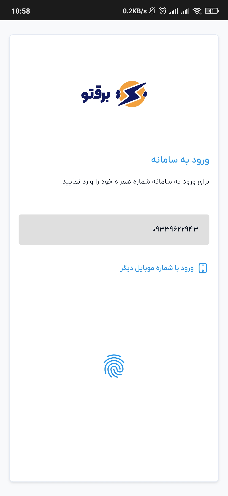 |
| Dashboard | 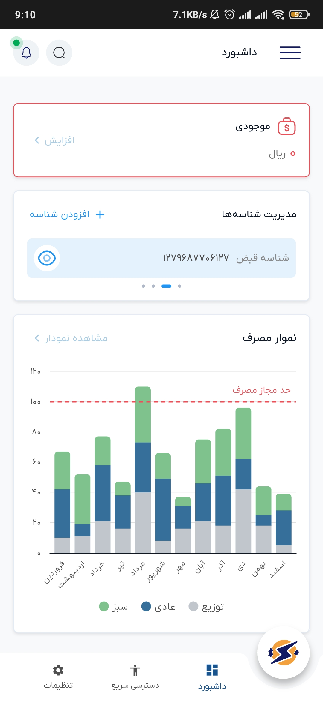 |
| OTP | 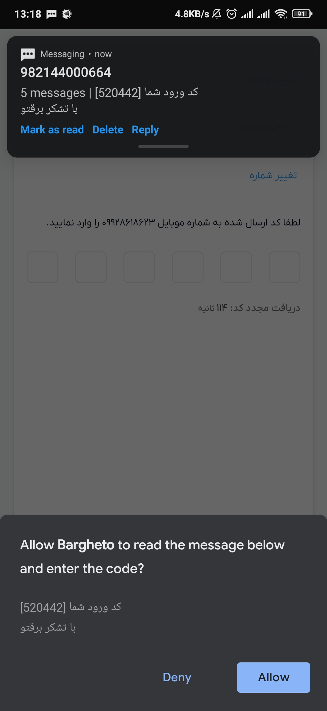 |
| Drawer | 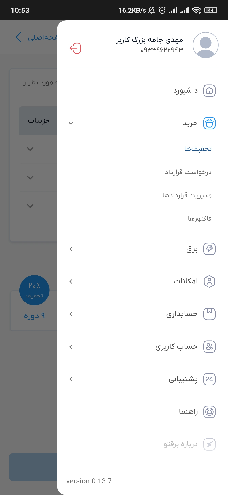 |
| Credit | 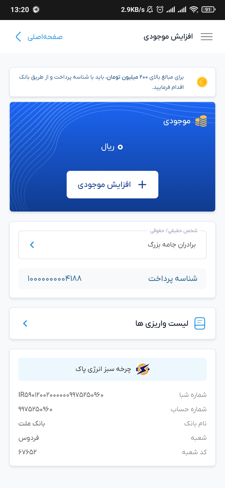 |
| User | 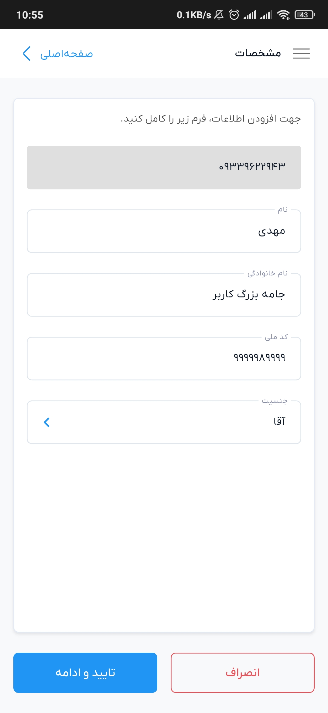 |
| Accounting | 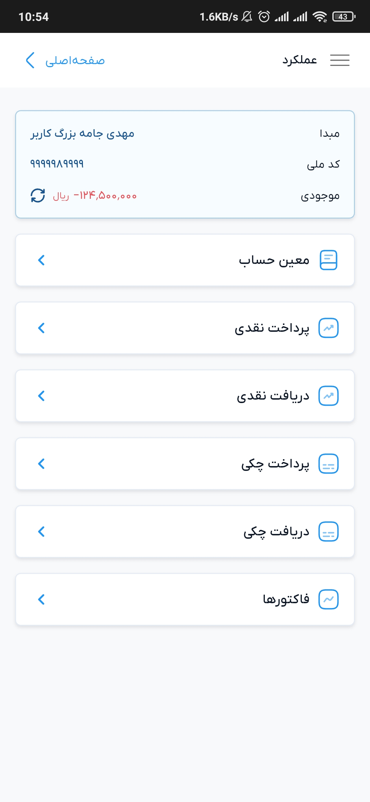 |
| Bills | 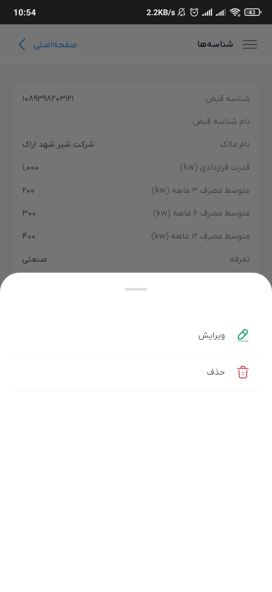 |
| Add Contract | 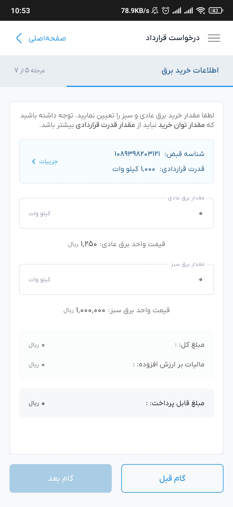 |
| Contracts | 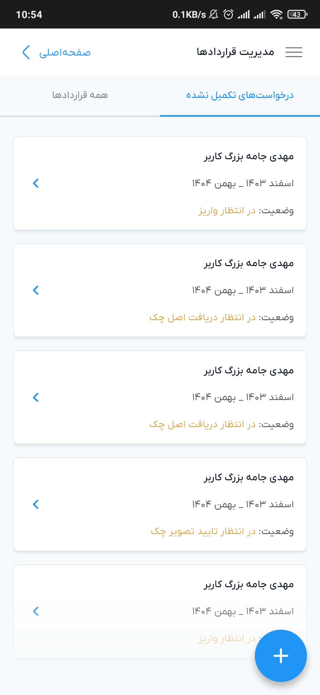 |
| Contract Details | 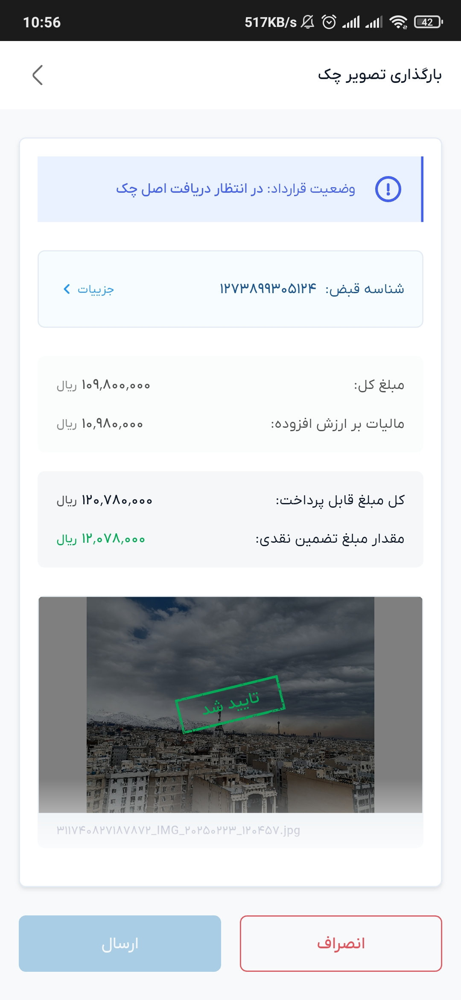 |
| Ticketing | 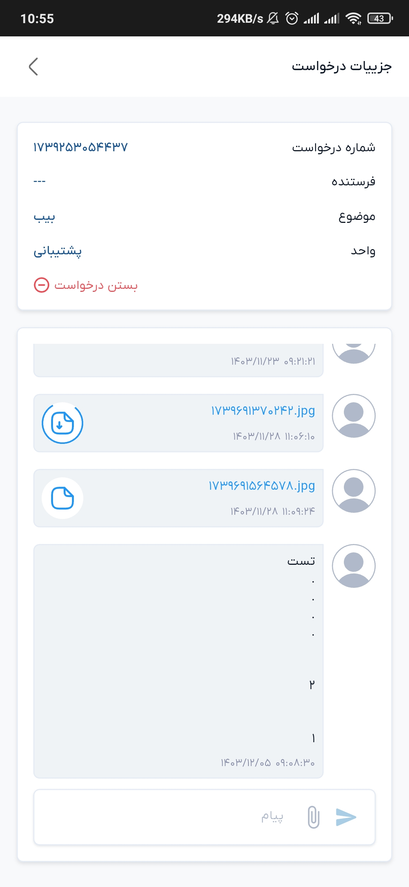 |

---

## 📄 License

This repository is for portfolio and presentation purposes only. The app's source code is not publicly available.
